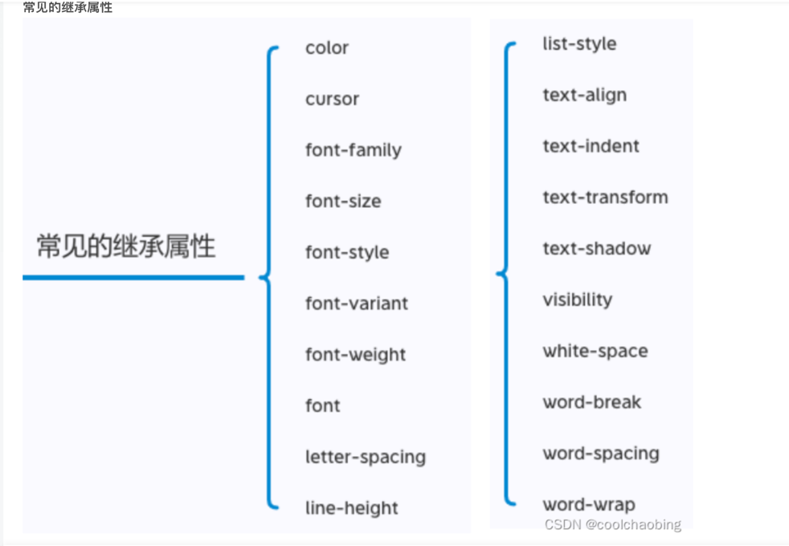
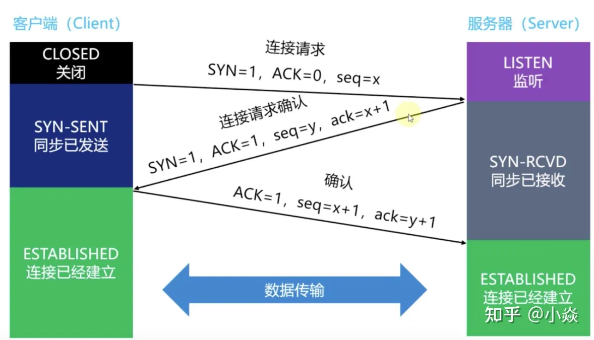
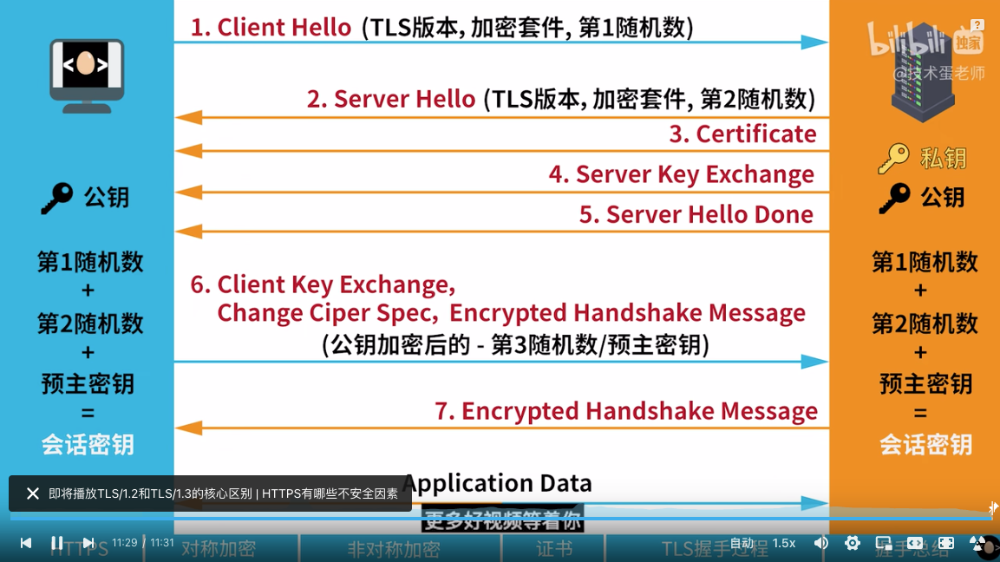

# 前端面试题集锦

### 基础

#### 1.css继承

#### 2.padding会撑开盒子，但是当盒子没有width时候则不会撑开
#### 3.盒子居中方法
1. flex (子盒子可以不给宽度)
```css
body{
    display: flex;
    justify-content: center;
    align-items: center;
}
```
##### 拓展 flex的用法

父项配置：<br/>
flex-direction：设置主轴方向<br/>
flex-wrap: 设置子元素是否换行<br/>
flex-flow :复合属性相当于同时设置flex-direction和flex-warp<br/>
justify-content: 设置主轴元素排列<br/>
align-items: 设置侧轴上子元素的排列（设置每个子项）<br/>
align-content: 设置侧轴上子元素的排列 将flex子项当做一个整体 只对多行起作用<br/>

子项配置<br/>
flex:子项占用的份数   ：简写形式 完整写法应该是
align-self:控制自己在侧轴的排列方式
order: 排序 默认为0
flex-grow: 索取父容器的剩余空间  控制放大比例，默认0  
flex-shrink:默认1 flex-shrink 属性指定了 flex 元素的收缩规则，默认值是1。
    在flex 元素的默认宽度之和大于容器的宽度时候，元素会发生收缩，其收缩的大小的依据是 
    flex-shrink 值。
flex-basis: 设置具体大小  它的初始值是 auto，此时浏览器会检查元素是否设置了 width 属性值。
    如果有，则使用 width 的值作为 flex-basis 的值；如果没有，则用元素内容自身的大小。
    如果 flex-basis 的值不是 auto，width 属性会被忽略（权重比较高）

2.margin:auto (需要高度)
```css
.item {
    width: 200px;
    height:200px;
    margin: auto;
}
```
3.定位加位移 (transition加position，可不知道自己的width)
```css
.parent {
    width: 300px;
    height: 200px;
    background: rgb(203, 192, 255);
    position: relative;
}
.child {
    width: 50px;
    height: 50px;
    background: rgb(221, 201, 73);
    position: absolute;
    left: 50%;
    top: 50%;
    transform: translate(-50%,-50%);
}
```
4.绝对定位盒子居中 (明确知道自己的width)
```css
.item {
    position: absolute;
    left:50%;
    margin-left:-100px
}
```
5.grid布局
```css
div {
    height: 100%;
    width: 100%;
    display: grid;
    justify-content: center;
    align-items: center;
}
```
6.绝对定位加置零法 
```css
div {
    background: red;
    width: 100px;
    height: 40px;
    position: absolute;
    left: 0;
    top: 0;
    right: 0;
    bottom: 0;
    margin: auto;
}
```


#### 4.css盒子模式
css中分为两种盒子模型
1.content-box: （正常盒子模型）盒子的实际大小 = width + border + padding （所以一般获取盒子的offsetWidth大于width属性的值）<br/>
2.border-box: （怪异盒子模式 ie默认的方式）盒子实际大小 = width (padding和border不会撑大盒子，前提是padding和border不会超过width的宽度)
设置盒模型 box-sizing:content-box
用途：正常盒模型主要用于PC端，怪异盒模型主要用于手机端。


#### bfc ifc ffc gfc
##### 什么是bfc?
bfc(block formatting contexts 格式化上下文) 是页面中的一块渲染区域，并且有自己的一套渲染规则
它决定了其子元素如何定位，以及和其他元素的关系和相互作用。需要注意的是，它并不会影响区域外的元素
我理解的就是，只要触发了bfc 那这个区域就会自动形成一个独立渲染的区域，不会影响别人的渲染。这也是为什么
设置overflow = hidden的时候 不会超出盒子边框

##### 触发bfc条件：
根元素（<html>）
浮动元素（元素的 float 不是 none）
绝对定位元素（元素的 position 为 absolute 或 fixed）
行内块元素（元素的 display 为 inline-block）
表格单元格（元素的 display 为 table-cell，HTML表格单元格默认为该值）
表格标题（元素的 display 为 table-caption，HTML表格标题默认为该值）
display:flex
匿名表格单元格元素（元素的 display 为 table、``table-row、 table-row-group、``table-header-group、``table-footer-group（分别是HTML table、row、tbody、thead、tfoot 的默认属性）或 inline-table）
overflow 计算值(Computed)不为 visible 的块元素
display 值为 flow-root 的元素
contain 值为 layout、content或 paint 的元素
弹性元素（display 为 flex 或 inline-flex元素的直接子元素）
网格元素（display 为 grid 或 inline-grid 元素的直接子元素）
多列容器（元素的 column-count 或 column-width (en-US) 不为 auto，包括 ``column-count 为 1）
column-span 为 all 的元素始终会创建一个新的BFC，即使该元素没有包裹在一个多列容器中（标准变更，Chrome bug）。

##### bfc规则
内部的Box会在垂直方向，一个接一个地放置。
Box垂直方向的距离由margin决定。属于同一个BFC的两个相邻Box的margin会发生重叠。
每个元素的margin box的左边， 与包含块border box的左边相接触(对于从左往右的格式化，否则相反)。即使存在浮动也是如此。
BFC的区域不会与float box重叠。
BFC就是页面上的一个隔离的独立容器，容器里面的子元素不会影响到外面的元素。反之也如此。
计算BFC的高度时，浮动元素也参与计算。

##### 应用场景
1.解决margin重叠的问题
2.解决高度坍塌问题
3.清除浮动

##### 相似的ifc ffc gfc
ifc规则：
在一个IFC内，子元素是水平方向横向排列的，并且垂直方向起点为元素顶部。

子元素只会计算横向样式空间，【padding、border、margin】，垂直方向样式空间不会被计算，【padding、border、margin】。

在垂直方向上，子元素会以不同形式来对齐（vertical-align）

能把在一行上的框都完全包含进去的一个矩形区域，被称为该行的行框（line box）。行框的宽度是由包含块（containing box）和与其中的浮动来决定。

IFC中的line box一般左右边贴紧其包含块，但float元素会优先排列。

IFC中的line box高度由 CSS 行高计算规则来确定，同个IFC下的多个line box高度可能会不同。

当 inline boxes的总宽度少于包含它们的line box时，其水平渲染规则由 text-align 属性值来决定。

当一个inline box超过父元素的宽度时，它会被分割成多个boxes，这些boxes分布在多个line box中。如果子元素未设置强制换行的情况下，inline box将不可被分割，将会溢出父元素。

__应用__ ：当一个块要在环境中水平居中时，设置其为inline-block则会在外层产生IFC，通过text-align则可以使其水平居中。


ffc和gfc这里就不多赘述了 都有对应的规则 


##### 清除浮动的几种方法
1.clear：both
2.overflow：hidden|auto|scroll
3.伪元素 （闭合便签法 不让盒子跑出去）

##### 文字溢出省略号表示
```css
text {
    white-space: nowrap;
    overflow: hidden;
    text-overflow: ellipsis;
}
```

##### new操作符做了些什么？
1.创建一个空对象
2.将该对象的原型指向构造函数的原型对象
3.将构建函数中的this绑定到新建的对象obj上
4.根据构造函数的返回值，返回对象，如果值为非对象类型则返回obj对象若为对象类型则返回该对象
```js
function mynew(Func, ...args) {
    // 1.创建一个新对象
    const obj = {}
    // 2.新对象原型指向构造函数原型对象
    obj.__proto__ = Func.prototype
    // 3.将构建函数的this指向新对象
    let result = Func.apply(obj, args)
    // 4.根据返回值判断
    return result instanceof Object ? result : obj
}
```

##### 函数柯里化
将传入多个参数转换为调用多次函数的分别传入参数的形式
```js
// 非函数柯里化
var add = function (x,y) {
    return x+y;
}
add(3,4) //7

// 函数柯里化
var add2 = function (x) {
    //**返回函数**
    return function (y) {
        return x+y;
    }
}
add2(3)(4) //7
```

###### 好处？函数柯里化的主要作用和特点就是参数复用、提前返回和延迟执行。


##### 高阶函数
将函数作为参数传入并且返回新函数的函数为高阶函数<br/>
以下为高阶函数封装的缓存函数
```js
const memoize = function (func, content) {
  let cache = Object.create(null)
  content = content || this
  return (...key) => {
    if (!cache[key]) {
      cache[key] = func.apply(content, key)
    }
    return cache[key]
  }
}
```

##### js继承的六种方式
###### 1.原型链继承（EcmaScript的主要继承方式）
```js
function Father() {
    this.fatherName = "fatherName"
}
Father.prototype.getFatherName = function () {
    return this.fatherName
}

function Child(){
    this.childName = "childName"
}

Child.prototype = new Father()  // 指定原型链
Child.prototype.getChildName = function () {
    return this.childName
}
let child = new Child()
console.log(child.getChildName())
```
:::warning
问题：
所有子类都会共享Father上的属性，一旦某个子类更改了Father上的属性，那么整个子类都会更改，所以一般把属性都定义在构造函数里
:::
###### 2.盗用构造函数继承
优点：给父类构造函数传参
```js
function Father() {
    this.fatherName = "fatherName"
}

function Child() {
    Father.call(this)
}
let child = new Child()
console.log(child.fatherName)
```
:::warning
问题：必须在父类构造函数里定义方法，因此函数不能复用，子类也不能访问父类原型上定义的方法
:::

###### 3.组合模式（原型链+构造函数）
```js
function SuperType(name){
    this.name = name;
    this.colors = ["red","blue","green"];
}
SuperType.prototype.sayName = function() {
    console.log(this.name);
};
function SubType(name, age){
    // 继承属性 第二次调用
    SuperType.call(this, name);
    this.age = age;
}
// 继承方法 第一次调用
SubType.prototype = new SuperType();
SubType.prototype.sayAge = function() {
    console.log(this.age);
};
let instance1 = new SubType("Nicholas", 29);
instance1.colors.push("black");
console.log(instance1.colors); //["red,blue,green,black"]
instance1.sayName(); // "Nicholas";
instance1.sayAge(); // 29
let instance2 = new SubType("Greg", 27);
console.log(instance2.colors); // ["red,blue,green"]
instance2.sayName(); // "Greg";
instance2.sayAge(); // 27
```

###### 4.原型式继承
Object.create()
```js
let father = {fatherName:'fatherName'}
let child = Object.create(father)
```

###### 5.寄生式继承
```js
function object(person) {
 function F() {}
 F.prototype = person
 return new F()
}
function createAnother(original){
    let clone = object(original); // 通过调用函数创建一个新对象
    clone.sayHi = function() { // 以某种方式增强这个对象
    console.log("hi");
};
    return clone; // 返回这个对象
}
```

###### 6.寄生组合式继承（引入类型继承最佳的模式）
```js
//核心代码
function object(person) {
 function F(params) {}
 F.prototype = person
 return new F()
}
function inheritPrototype(SubType,SuperType) {
 let prototype = object(SuperType.prototype) //生成一个父类原型的副本
 
 //重写这个实例的constructor
 prototype.constructor = SubType
 
 //将这个对象副本赋值给 子类的原型
 SubType.prototype = prototype
}
 
function SuperType(name) {
    this.name = name;
    this.colors = ["red","blue","green"];
}
SuperType.prototype.sayName = function() {
    console.log(this.name);
};
function SubType(name, age) {
    SuperType.call(this, name);
    this.age = age;
}
 
//调用inheritPrototype函数给子类原型赋值,修复了组合继承的问题
inheritPrototype(SubType, SuperType);
 
SubType.prototype.sayAge = function() {
    console.log(this.age);
};
```

##### defer 和 async 区别
首先这两个属性只对有src属性的script标签生效
两者都是浏览器在下载脚本同时解析和渲染文档
defer 并行加载，在整个文档加载渲染后在DOMContentLoaded事件触发之前执行（有顺序）
async 并行加载，尽早的执行脚本（无序），async请求回来的脚本会执行并会阻塞html的解析（若解析完后才资源才请求到则不阻塞解析）

##### prefetch 和 preload 区别
preload 是提前将资源下载到缓存中，不执行，什么时候用什么时候执行文件（字体图标，css样式表等），尽早下载首屏需要的关键信息，从而提升页面渲染性能
prefetch 是跟你在浏览器闲置状态下去下载或预取用户在不久的将来可能访问的文档，并静默提取到缓存中
preload的设计初衷是为了尽早加载首屏需要的关键资源，从而提升页面渲染性能。
目前浏览器基本上都具备预测解析能力，可以提前解析入口html中外链的资源，因此入口脚本文件、样式文件等不需要特意进行preload。
但是一些隐藏在CSS和JavaScript中的资源，如字体文件，本身是首屏关键资源，但当css文件解析之后才会被浏览器加载。这种场景适合使用preload进行声明，尽早进行资源加载，避免页面渲染延迟。
与preload不同，prefetch声明的是将来可能访问的资源，因此适合对异步加载的模块、可能跳转到的其他路由页面进行资源缓存；对于一些将来大概率会访问的资源，如优惠券列表的背景图、常见的加载失败icon等，也较为适用。
**preload优先级大于prefetch**
##### 预加载和懒加载
预加载就是通过提前获取资源到缓存中，需要的时候直接从缓存拿数据，加快渲染能力，优化用户体验，优先级preload>prefetch
懒加载是图片传输到可视区域才加载出来。懒加载实现方法：
1. 普通


##### 节流和防抖
节流：一定时间内只触发一次
```javascript
function throttle(fun,second){
    let timer = null
    return function () {
        if(timer)return 
        timer = setTimeout(()=>{
            fun()
            timer = null
        },second*1000)
    }
}
```
防抖：一定时间内只触发最后一次
```javascript
function antiShake(fun,t) {
    let timer = null
    return function(){
        if(timer){clearTimeout(timer);timer = null}
        timer = setTimeout(()=>{
            fun()
            timer = null
        },t)
    }
}
```
##### axios如何中断请求？xhr和fetch呢？promise能中断吗 若要中断要怎么做？
###### axios中断请求：cancelToken（是由kevin smith提出）或者 AbortController
```js
//axios版本 0.22以上 用fetch取消请求方式
const controller = new AbortController();

axios.get('/foo/bar', {
    signal: controller.signal
}).then(function(response) {
    //...
});
// 取消请求
controller.abort()

//axios版本 0.22以下 用canceltoken取消请求方式
const CancelToken = axios.CancelToken;  // 本质是取消promise 
const source = CancelToken.source();
axios.get('/user/12345', {
    cancelToken: source.token
}).catch(function (thrown) {
    if (axios.isCancel(thrown)) {
        console.log('Request canceled', thrown.message);
    } else {
        // 处理错误
    }
});
axios.post('/user/12345', {
    name: 'new name'
}, {
    cancelToken: source.token
})

// 取消请求（message 参数是可选的）
source.cancel('Operation canceled by the user.');

```
###### xhr取消：xhr.abort()
###### fetch取消：通过AbortController/ AbortSignal
```js
let abortController = new AbortController()
fetch("https://www.baidu.com",{signal:abortController.signal}).catch(()=>{
    console.log("请求中断")
})
setTimeout(()=>abortController.abort(),1000)  // 取消请求
```

###### promise取消用扩展：cancelToken
```js
// TODO 暂留
```
##### 哪些是宏任务哪些是微任务
###### 微任务
promise.then
MutationObserve
process.nextTick

###### 宏任务
script (可以理解为外层同步代码)
setTimeout/setInterval
UI rendering/UI事件
postMessage、MessageChannel
setImmediate、I/O（Node.js）

##### postMessage是什么?
跨域通信的对象
```js
// TODO 待补充
```


##### 浏览器页面渲染的流程是什么（输入url后页面发生什么）？
大概分为：
###### 1.解析DNS（根据域名找ip地址）
首先从浏览器缓存中去找，若没有则去操作系统缓存中找，若还没有则去路由器中的DNS中查找，
还没有就去isp（网络业务提供商）的DNS服务器中查找查找，DNS服务器中查找

###### 2.建立tcp链接（osi七层模型）
获取到ip地址后根据tcp/ip协议发送tcp连接请求
这里涉及到tcp的三次握手，四次挥手（为什么是三次握手呢？因为通信本来就不可能100%可靠，三次握手是最大程度保持连接可靠性，四次握手没必要还增加性能消耗）
tcp链接过程：
客户端发送syn=1（表示希望进行tcp链接）并且发送随机序号seq=x  ACK=0 客户端进入SYN_SEND 状态
服务端收到syn链接请求后，给客户端回一个ack=x+1(校验数) ACK=1(表示确定) 然后自己也发送个seq=y（用来校验客户端是否正确连接） 服务器进入SYN_RECV状态
客户端收到后 发送ack=y+1 ACK=1 seq=x+1 双方进入ESTABLISHED状态
三次握手成功

###### 3.发送http请求
通过http协议 向服务端发送请求，服务端相应数据（注意此时可能会有缓存）
缓存有强缓存和协商缓存两种
强缓存：浏览器判断本地文件未过期时就强制使用本地缓存的文件，无需发起请求 此时请求状态是200 from cache
如何设置强缓存？ 通过cache-control属性 设置max-age来规定过期时长，从而来判断缓存是否失效
这比之前使用的expires更安全
cache-control属性：
* public：客户端和代理服务器都可以缓存
* private：客户端可以缓存
* max-age：t  缓存内容在t秒后失效
* no-cache：使用协商缓存验证缓存的数据
* no-store：所有内容都不缓存
协商缓存：客户端和服务端对比判断是否使用缓存，浏览器发送请求 来判断本地缓存是否被修改
如何实现对比？由etag和if-none-match来匹配  __etag__ :服务器告诉客户端当前资源在服务器的唯一标识
__if-none-match__ 浏览器向服务端发送请求头中包含此字段 值为该资源的唯一标识，服务器拿到后跟请求资源唯一标识进行比对，
不同则说明资源被改过，返回整个资源，状态码200 相同则表示无需修改 返回响应头 状态码304 浏览器从缓存读取数据

###### 4.返回html字符串，浏览器解析html
浏览器解析html步骤：
1. 首先浏览器会开启一个预解析器去下载和解析css下载js，渲染主线程从头开始解析html构建为DOM树，遇见js（不带defer async）的会等到js执行完再解析html，同时与解析器解析css位CSSOM，
（css不会阻塞html解析的原理，运行在不同线程中的）
2. 将DOM和CSSOM合并，遍历DOM树的每个节点，然后计算每个节点的样式，此时相对单位变成绝对单位
3. 根据DOM树计算布局（layout）信息，获取每个元素的几何信息
4. 然后分层渲染，提高渲染速度，当某一层变化后，只更新当层就行了，是浏览器自动计算的优化项（可以使用will-change 属性，告诉浏览器哪里可能会经常变化，浏览器根据情况分层）
5. 绘制，为每一层生成绘制指令（渲染主线程工作到此为止）
6. 分块：将每一层分为多个小块（会开启合成线程做这个事，合成线程会开启线程池取多个线程处理）
7. 光栅化：将每个块图变为位图（像素信息），优先处理靠近视图窗口的，开启gpu加速
8. 画：将每个像素画在屏幕上，以及考虑到旋转缩放变形
（计，布，层，绘，块，删，画）
这里就要引出重绘和回流：
回流：元素的几何信息改变，布局改变，会重新计算样式再重复上面的流程（从计算样式开始），会比较消耗性能，
重绘：仅仅作用于最后一步（画）上，所以会很流畅，也不会被js操作阻塞（因为根本没运行在渲染主线程中，而是在合成线程中完成）
回流一定会引起重绘！！！

（这里又要拓展事件循环和单线程模型了，又要引出异步问题了宏任务微任务的概念了）
到此为整个过程结束

##### 哪些操作会造成回流？哪些操作会造成重绘？
当渲染树中部分或者全部尺寸，结构发送变化的时候，浏览器会重新渲染部分或者全部文档的过程
1. 对Dom元素进行几何属性进行修改
2. 更改Dom树结构
3. 获取某些特定的属性值：offsetWidth，offsetHeight，offsetTop，offsetLeft，scrollTop，scrollLeft，scrollWidth，scrollHeight，client系列和getComputedStyle方法
即通过即时计算才能得到，浏览器就会去进行页面布局计算

##### 正侧表达式？
```js
// TODO 正则待补充
```


##### vue的$nextTick原理
nextTick是等待下次dom更新刷新的工具方法
nextTick 是vue模仿浏览器单线程模型事件循环的实践方式
nextTick表示 并不是数据改变他视图就立即改变 而是异步更新 而是在下一次DOM更新循环之后执行的延迟回调函数，用于在修改数据后调用，获取更新后的DOM。
vue是异步更新策略，数据发生变化，vue并不会立刻更新DOM，而是开启一个队列，把组件更新函数保存在队列中，放在nextTick中的函数会放在更新函数全部执行后执行。
原理：将任务放在一个队列中，然后等待promise.then方法，

##### 如何在created中获得dom元素？
在created中用nextTick()

##### promiseA+规范

##### 首屏优化
1. ssr 服务端渲染 （next.js nuxt.js）对seo友好
2. 

##### gzip(基于deflate压缩算法)
Gzip 是一种用于文件压缩与解压缩的文件格式。它基于 Deflate 算法，可将文件（译者注：快速地、流式地）压缩地更小，
从而实现更快的网络传输。Web 服务器与现代浏览器普遍地支持 Gzip，这意味着服务器可以在发送文件之前自动使用 Gzip 压缩文件，
而浏览器可以在接收文件时自行解压缩文件。
启用方式:浏览器发送请求到服务器，服务器根据请求头中的Accept-Encoding字段判断该浏览器是否支持Gzip压缩。如果不支持，
则只响应未经压缩的资源即可；如果支持，则进入后续流程。

##### 强缓存和协商缓存


##### 常见状态码
###### 100系列
100：continue 
101：协议切换

###### 200系列
200：ok请求成功
201：请求被创建
202：请求已经被接受，但服务器无响应
203：包含的信息不是来自服务器
204：无实体部分
205：告知浏览器清除当前页面所有表单元素

###### 300系列
300：有多个对应的资源，返回列表可选择。
301：永久重定向
302：临时重定向
303：对重定向由浏览器自动从post转为get
304：未修改，从缓存中读取
307：对重定向由用户决定是否重新发起post请求
###### 400系列
400：客户端请求错误
401：未认证
402：暂时保留的状态码
403：禁止访问
404：找不到该资源
405：请求方法不被允许
408：超时
413：资源太大，服务端处理不了
###### 500系列
500：服务端出现逻辑错误
501：超出服务器处理范围能力以内（请求方法不支持等）
502：网关错误
503：服务器暂时没能力处理请求（未来可能可以）

##### vueRouter 几个守卫？和生命周期

##### vue组件通信？
v-model ，.sync
父子组件通信: props/$emit、$parent/$children、 provide/inject 、 ref/$refs 、$attrs/$listeners、slot
兄弟组件通信: eventBus 、 vuex、 自己实现简单的 Store 模式
跨级通信: eventBus、 Vuex、 自己实现简单的 Store 模式、 provide / inject 、 $attrs / $listeners

##### v-on能监听多个事件吗
可以，对象形式

##### vuex相关
vuex的重要些，vue期待一种简单的单项数据流的管理方式，当遇到多个组件共享式状态时，数据流的简洁性会被破坏，此时就有必要把共享状态抽取出来，
用一个全局单例模式去管理，通过定义和隔离状态管理中的各种概念必过通过强制规则维持视图和状态间的独立性，代码会变得更加简洁且易维护，这也是vuex和
redux这类状态管理工具的必要性
有 state，mutation，action，getter，module

##### vue的最佳实践
1. 编码风格
2. 性能方面

##### 说说从template到render的处理的过程
vue有个对的编译器模块，叫"compiler",主要作用是讲用户编写的template编译为js中可执行的render函数，而且在编译中，可以发现代码哪些变量是动态的
哪些是静态的，从而对后面只处理动态的部分，diff算法时可以减少节点。编译器执行会对template进行编译（正则表达式），称为parse，变成ast抽象语法树（js对象）
在将AST进行深度加工，叫做transform，最后生成js代码，也叫render函数。
结束之后会得到js对象，

##### 如何解决异步请求竞态问题？
1.发送新请求时取消上次请求即可
```js

```
2.忽略过期请求
```js

```

##### 移动端适配？响应式布局？


##### 跨域问题？解决方案？
编程不可访问性  UI可访问性
跨域问题在哪儿？xhr请求不能跨域，
双方同意的基础上 实现数据的可编程访问
伪跨域：主域名一样，子域名不一样：设置document.domain相同

跨域方案？
第一类：带域名限制的：cors(添加响应头，白名单) ，iframe(或者window.open)+postMessage，websocket(不属于http协议所以无跨域问题)
第二类：无法限制来访域名：jsonp（无法区分调用方），url传参和表单提交（可以通过document.refer限制），服务器代理
第三类（绝对不能使用），window.name跨域（没有安全保障，可能会被窃听，不可弥https
补）


##### cookie session token 对比 应用场景
cookie是浏览器

##### 介绍下websocket协议
支持浏览器与服务器进行全双工通信的协议，属于应用层协议，基于tcp协议，复用了http的握手通道，弥补http协议的持久通信上的能力的不足，通过http协议握手，无跨域问题
##### keep-alive组件

##### computed 和 watch
computed：会有个项响应式的返回值，由组件数据派生出数据，是懒加载（用户使用的时候才去计算）有缓存（用dirty标识符，不会重复执行计算，节省性能），不支持异步，即可读又可写
watch：侦测变化执行回调，没缓存支持异步，有deep和immediate选项
vue3中watch有变化，不能能这侧一个点操作符以外的字符串表达形式
watchEffect：回调函数里的变量用到谁就监视谁，一旦变化重新执行回调，类似computed但更注重过程

##### async await原理及其实现
迭代器加promise

##### 发布订阅和观察着模式的区别
是否有调度中心

##### 前端模块化方案？
原始模块  CommonJS esModule  AMD UMD
原始模块：函数模块 （在vue中好像见过）
AMD(Asynchronous module Definition)异步模块定义：浏览器不支持，要借助requireJs才支持
```js
//TODO 示例待补充
```
CommonJS:同步模块加载规范，主要是node中，require()
```js

```
UMD(Universal Module Definition):通用模块加载规范，是对前三种的简单整合
```js

```
ES Module：es6的新规范，浏览器已经支持

##### 浏览器缓存？
协商缓存和强缓存

###### 强缓存（expires，cache-control）
expires是http1.0中声明的控制缓存失效日期的时间戳字段，由服务端指定后通过响应头来告知


##### HTTP 1.0 1.1 2.0 3.0区别？
###### HTTP1.0
默认使用短连接，没进行一次http请求都会创建一个tcp链接（消耗性能）
###### HTTP1.1
默认使用长链接（keep-alive）当一个网页打开操作时候不会关闭（长链接并非永久有效，服务端可配置时间）
###### HTTP2.0
1.http2.0采用多路复用 同一个tcp上请求多个资源，分成更小的帧请求，性能提升
2.http2.0在应用层和传输层层之间加了个二进制分帧层，以实现低延迟高吞吐量
3.http2.0自带服务器主动推送功能
4.可以设置请求优先级（服务器根据请求优先级来确定要分配多少资源处理该请求）
5.HTTP2.0 头部压缩 减少报文传输体积
（关键词：多路复用 二进制帧 主动推送 头部压缩 优先级）
###### HTTP3.0
放弃tcp 使用基于udp的QUIC来实现


##### 了解HTTPS（HTTP+SSL）吗？
非对称加密和对称加密的混合方法
通过ca机构颁发证书



##### get和post区别
###### 一般区别
GET在浏览器回退时是无害的，而POST会再次提交请求。
GET产生的URL地址可以被Bookmark，而POST不可以。
GET请求会被浏览器主动cache，而POST不会，除非手动设置。
GET请求只能进行url编码，而POST支持多种编码方式。
GET请求参数会被完整保留在浏览器历史记录里，而POST中的参数不会被保留。
GET请求在URL中传送的参数是有长度限制的，而POST么有。
对参数的数据类型，GET只接受ASCII字符，而POST没有限制。
GET比POST更不安全，因为参数直接暴露在URL上，所以不能用来传递敏感信息。
GET参数通过URL传递，POST放在Request body中。
###### 跟重要的区别
GET会产生一个TCP数据包，而POST会产生两个TCP数据包。
对于GET方式的请求，浏览器会把http header和data一并发送出去，服务器响应200(返回数据);
而对于POST，浏览器先发送header，服务器响应100 continue，浏览器再发送data，服务器响应200 ok(返回数据)。（根据浏览器厂商觉得 firefox就发送一次）

##### 浏览器最多支持同一个域名同时发送多少个请求？
6-8个，可以使用域名分片技术来巧妙的避开（不建议，消耗性能，会多开tcp链接）

##### vue生命周期函数？各函数有哪些特点？
beforeCreate：
created:
beforeMount:
Mounted:
beforeUpdate:
updated:
beforeDestroy:
destroyed:

##### vue-router生命周期？
导航被触发。
在失活的组件里调用 beforeRouteLeave 守卫。
调用全局的 beforeEach 守卫。
在重用的组件里调用 beforeRouteUpdate 守卫 (2.2+)。
在路由配置里调用 beforeEnter。
解析异步路由组件。
在被激活的组件里调用 beforeRouteEnter。
调用全局的 beforeResolve 守卫 (2.5+)。
导航被确认。
调用全局的 afterEach 钩子。
触发 DOM 更新。
调用 beforeRouteEnter 守卫中传给 next 的回调函数，创建好的组件实例会作为回调函数的参数传入。

##### http的简单请求和复杂请求
简单请求：
复杂请求：会发送option预检请求

##### 服务端主动推送几种方式?
1. 轮询
2. websocket
3. sse（server-send-event）

##### 了解typescript？
###### interface 与 type区别

##### 了解react?

##### 如何冻结一个对象
Object.preventExtensions 不允许给自身添加属性（可以给原型添加属性，但是不能修改原型的数据）
Object.seal(): 不允许增加删除自有属性 用Object.isSealed()判断
Object.freeze()：比seal更严格 锁定对象 不允许修改添加自有属性，访问器方法（set，get不会受到影响）Object.isFrozen()判断是否锁定

##### proxy与Object.defineProperty()区别？？
proxy是es6新提出的代理对象，能够劫持所有行为，相比较Object.defineProperty

##### 如何让 （a===1 && a===2 && a===3）为true
a为对象
1.Object.defineProperty()
2.重写toString()
3.重写valueOf()

##### toString 和 valueOf 区别
都是对象自带属性，对于Date类型一般先调用toString，对于其他对象则先调用valueOf

##### 常见网络攻击及其防御
###### csrf
防御方法
###### xss
防御方法：拒绝用户输入一切html元素（用innerText 或者 正则过滤用户输入的信息），在让web应用始终在一个iframe标签中并且设置sanbox为true

##### pnpm yarn npm 区别


##### localstorage安全问题?

##### vue常见优化手段
1. v-for使用key
2. 使用冻结对象 Object.freeze()
3. 使用函数式组件
4. 使用计算属性
5. 非实时绑定的表单项
6. 使用延迟装载

##### v-for v-if 优先级？
vue2中是v-for 优先于v-if
Vue3是：v-if优先于v-for的  不能一起用 可能会报错 用 computed结合数组的filter使用

##### X-Frame-Options? 
设置该页面是否能被iframe标签使用

##### iframe的sanbox？

##### addEventListener的完整写法？
dom.addEventListener("event",callback,{capture:true,once:true,passive:true})  capture:捕获阶段，once：调用一次自动移除事件，passive：事件处理程序永远不调用preventDefault()

##### getBoundingClientRect()? elementFromPoint()?

##### scrollIntoView()?

##### offset系列 client系列 scroll系列 区别？
offset:获取元素的位置大小等。获取元素举例带有定位父元素的位置，获取元素自身的大小（高度，宽度（包括padding，border）），返回值不带单位
client:获取元素可视区的相关信息，通过client系列可以动态的到元素边框大小，元素大小等属性。
 


##### vue-router原理？
三种模式：


##### 结构化克隆？

##### 了解fetch吗

##### 箭头函数与普通函数区别？
1. 没有自己的this（靠继承外部）（主要差别）
2. 不能作为构造函数
3. 没有argument
4. 没有prototype属性
5. 没有new.target

##### localStorage 和 sessionStorage区别

##### 深拷贝浅拷贝？

##### cookie session jwt 区别？
cookie是传递数据的载体

sessionId是服务器保存的用户的身份

token是由服务器生成 客户端保存 服务器经过加密算法解密后验证的过程 头部：算法  载体：信息  签名（服务端用头部和信息和私钥加密成的字符串）

##### 受控组件和非受控组件的区别
在React中 受控组件依赖状态，非受控组件不受状态的控制
##### es6有哪些新语法
1. 引入 class 类
2. 模块化 esModule
3. 箭头函数
4. 形参默认值
5. 模版字符串
6. 解构赋值
7. 新增set map对象
8. 新增proxy 代理构造函数
9. 迭代器生成器
10. 新增symbol
11. 新增api（isArray from of）
12. Math新增api
13. 新增 const，let 局部作用域

##### 如何影响浏览器对资源加载的优先级
浏览器的资源优先级分为 Highest、High、Medium、Low、Lowest
preload优先级大于prefetch
###### 通过 preload（预加载）
当浏览器“看”到这样的声明后，就会以一定的优先级在后台加载资源。加载完的资源放在HTTP缓存中。而等到要真正执行时，再按照正常方式用标签或者代码加载，即可从HTTP缓存取出资源。
```html
<link rel="preload" as="script" href="./important.js">
<link rel="preload" href="https://tiven.cn/js/test.js" as="javascript" onload="preloadHandle()" crossorigin media="(max-width:350px)">
<!--as 属性：告诉浏览器当前所要加载的资源类型--> audio document embed fetch font image script object style track video worker (webkit似乎禁用了video和audio的预加载和预提取)
<!--rel 属性设置为preload 将当前资源的优先级提高-->
<!--onload 回调函数-->
<!--跨源资源必须加上 crossorigin-->
<!--media 媒体查询-->
```
若预加载加载的资源在3s内没有被当前页面所使用，则控制台会发出警告
###### WO

```html
<!--预连接-->
<link rel="preconnect" href="https://esampel.com" crossorigin >

<!--预解析dns  将解析后的dns缓存在系统中-->
<link rel="dns-prefetch" href="http://www.baidu.com">
```

###### 预提取（prefetch）
prefetch用来声明将来可能用到的资源，在浏览器空闲时进行加载。
```html
<link rel="prefetch" href="1.html">
```
（这还是有点不太懂）参考资料 [https://www.codenong.com/s1190000037794877/](https://www.codenong.com/s1190000037794877/)

##### osi七层模型？tcp四层模型？那么五层模型是？
osi：物理层，数据链路层，网络层，传输层，会话层，表示层，应用层
tcp/ip：网络接口层，网际层，传输层，应用层
##### 数组去重？
1. set + 扩展运算符号
```javascript
let arr = [1,2,3,4,1,2,6]
let result = [...new Set(arr)]
```
2. for循环遍历
```javascript
let arr = [1,2,3,4,1,2,6]
let result = []
arr.forEach((item)=>{
    if (!result.includes(item))result.push(item)
})
console.log(result)
```
3. sort相邻去重
```javascript
let arr = [1,2,3,4,1,2,6,6]
arr.
arr.sort() // 排序
for (let i = 0;i<arr.length-1;i++){
    if(arr[i] === arr[i+1])arr.splice(i,1)
}
console.log(arr)
```
4. 其他方法去重 
与方法2类似，不过是通过indexOf，find，findIndex方法来判断的

##### 左侧固定，右侧自适应怎么做？
1. 左侧float，右侧margin-left
2. 左侧float，右侧 overflow：hidden 触发bfc
3. 左侧position：absolute，右侧margin-left
4. flex布局

##### 两边固定中间自适应怎么做？
1. flex ：flex-basis设置两边宽度，中间设置flex：1
2. float+calc()
3. position定位
核心：将父元素设置为position:relative；（相对定位）
子元素设置为绝对定位position:absolute；
左边列(固定宽度)：position:absolute; left:0;
中间列（自适应列）:position:absolute; left:(左边列的宽度);right:(右边列的宽度)
右边列（固定宽度）：position:absolute;right:0;


##### for循环，for of， for in，Array.prototype.forEach 区别？
```javascript
let arr = [ ,1,2,3,4,1,123,13] // 稀疏数组

// for 是实时的 length回不断变长
for(let i = 0 ;i<arr.length;i++){
    arr.push(i)
}

// for of 不会跳过稀疏元素，实时的，用来遍历可迭代数据
for(let i of arr){
    arr.push(i)
}

// foeEach会跳过稀疏元素，非实时的
arr.forEach((item)=>{
    console.log(item)
    arr.push(item)
})

// for in 是遍历对象属性的 遍历对象的可枚举属性包括继承的可枚举属性
```

##### 数组哪些操作会影响原数组？
push,pop,shift,unshift,splice,fill,copyWithin,sort,reverse

##### css命名规范？
BEM（block块 element元素 modifier修饰符）规范
1. 中画线（-）为每个单词的连接符，表示元素名字的多个单词的连接符
2. 单下划线（_）表示一个元素的状态
3. 双下划线（__）表示用于连接父元素和子元素
父元素选择器__子元素名_状态-n 
```css
/*表示.myList 类下的item的状态为small-10*/
.myList__item_small-10 {...}
```

##### 浏览器垃圾回收方式？
最常用：标记清理，当变量进入上下文中时变量会被加上存在上下文中的标记，
不常用：引用计数：对每个值都记录他的被引用的次数（严重问题：循环引用）
##### 了解pwa吗

##### 关于promise汇总？

##### jsBridge原理
js调用native：通过webview提供的接口，向其中注入对象，让js调用
native调用js：evaluateJavascript方法指定函数名，有回调
##### flex是哪些的缩写？
flex：flex-grow flex-shrink flex-basis

##### 并行请求？

##### 小数相加精度消失问题？

##### require和import区别
运行时，编译时

##### 父子组件及其mixins生命周期执行顺序？
mixin的beforeCreate > 父beforeCreate > mixin的created > 父created > mixin的beforeMount > 父beforeMount > 子beforeCreate > 子created > 子beforeMount > 子mounted > mixin的mounted >父mounted

##### 虚拟列表？

##### git常见命令
git

##### webpack配置？
###### webpack有哪些配置？
entry：输入
output：输出
module(rules)：loader
plugins：插件
mode: 模式
##### 如何用es5的函数模仿es6的class的constructor？

1. 严格模式下
2. 暂时性死区
3. 必须使用new调用（new.target，或者this.__proto __ ===xxx.prototype ）
4. 访问器 在 原型上和实例上都有且相同
5. 访问器属性不可枚举
6. 原型上的方法是不可枚举的
7. 方法函数不能被被new调用

##### css中的animation?


##### 在立即执行函数中执行 var x = y = 1 在全局作用域中会发生什么?
是从右往左赋值，解释为y=1(为临时全局变量) var x = y 为函数的局部变量

##### 生成指定范围的随机数
Math.random()*(max-min)+min


##### @import css

##### mvc和mvvm，mvp，MTV区别
三种软件架构模式
mvc:view
mvvm:只关注数据结构
mvp：

##### requestAnimationFrame
在一次重绘或回流中就完成，并且重绘或回流的时间间隔紧紧跟随浏览器的刷新频率
取消:cancelAnimationFrame

##### vue常用指令？
v-once v-model v-html v-text v-memory v-on v-show v-if v-else 
##### vue长列表优化思路
1. 采取分页
2. v-once
3. v-memo缓存
4. 虚拟滚动
5. 懒加载

##### 如何监听Vuex的状态的变化
1. watch (首选)
2. store.subscribe(cb)（写起来繁琐）
##### vue-router有几种模式？
三种：hash，history，memory


##### vue权限管理？
1. 页面权限
RBAC存在服务器、路由信息在前端配置通过addRoute设置（动态路由生成）
2. 按钮权限
实现 v-permission命令 看是否有权限

##### 对vue响应式的理解vue2与vue3区别？，与react的响应式的区别
proxy：懒处理（避免了defineProperty的递归），性能高，方便，（兼容性差）
React基于状态机，手动优化，数据不可变（react偏向数据不可变），需要setState驱动新的state替换老的state。
当数据改变时，以组件为根目录，默认全部重新渲染, 所以 React 中会需要 shouldComponentUpdate 这个生命周期函数方法来进行控制

###### vue2与vue3区别
1. 响应式原理 vue2为Object.defineProperty(),vue3为proxy
2. vue3支持碎片：组件可以有多个根节点
3. vue3是组合式api，vue3中所有写法卸载setup函数值，setup(props,context)，setup函数返回对象或者返回渲染函数，内部没有this，当组件内需要使用异步await时候直接使用，不需要在setup前加async
4. 生命周期钩子不同beforeCreate，create=》setup beforeDestroy，destroyed=》onBeforeUnmount,onUnmounted。

##### vue的diff算法？
借助了snabdom
递归过程，深度优先，同层比较
要分很多情况，文本
vue2是双端diff算法
vue3是快速diff算法

##### js判断数据类型？
1. typeof
2. instanceof
3. constructor
4. Object.property.toString.call()

##### vue和react相同点和区别
相同：数据驱视图，组件化，VDOM
两者核心思想不同：
写法不同：
diff算法不同
响应式原理不同：vue依赖收集，自动优化，数据可变，数据变化自动找到组件重新渲染，React基于状态机，手动优化，
数据不可变，需要setState驱动新的state替换老的state。当数据改变时，以组件为根目录，默认全部重新渲染, 
所以 React 中会需要 shouldComponentUpdate 这个生命周期函数方法来进行控制
源码差异

##### axios二次封装？

##### Vue中的render函数？
在Vue中，我们通常使用template和JSX语法来创建组件的DOM结构。但是，在某些情况下，我们需要更细粒度的控制组件的渲染过程，这时就可以使用render函数。
Vue中的render函数是用于将组件转换为虚拟DOM的JavaScript函数，它的作用可以概括为以下几点：
将组件的模板转换为虚拟DOM结构：在Vue中，组件的模板可以是template或JSX语法，而render函数可以将组件的模板转换为Virtual DOM对象，
这样便可以在组件中对DOM结构进行更加细致的控制和操作，实现更加灵活的组件渲染。
自定义组件的渲染逻辑：在Vue中，每个组件都有自己的渲染函数，这使得我们可以在组件内部自定义渲染逻辑，例如根据组件的状态、属性、插槽等来动态生成组件的DOM结构。
提高组件渲染性能：使用render函数可以在渲染过程中避免生成大量的中间VNode对象，从而提高组件的渲染性能。
需要注意的是，render函数也需要遵循一定的规则和语法，例如render函数必须返回一个VNode对象，不能直接操作DOM，等等。因此，在使用render函数时需要注意相关的语法和规则。

##### flex和inline-flex区别
flex默认是独占一行的，inline-flex是和inline元素类似的flex形式


##### 如何理解Function.prototype === Function.__ proto __  为true
因为Function本身也是一个Function对象，也就是var Function = new Function()，这看起来有点鸡和蛋的意思，
不过如果先给你一个蛋，那必然就是先有蛋后有鸡了。所以如果先给你一个Function对象的原形[[Prototype]]，
那么就可以通过一个函数构建出Function的实例了，这个函数就是Function本身。

##### 了解__proto __吗？
__Proto __属性返回对象的原型对象，但是该方法有严重的性能问题，已经不被推荐使用，取而代之的是Object.getPropertyOf(object).


##### babel和core.js?
Babel和CoreJS有一定的联系，因为它们都是为了解决JavaScript兼容性问题而存在的工具。
Babel可以将现代的JavaScript代码转换成向后兼容的代码，以便在较老版本的浏览器或其他环境中运行，但是它并没有提供对一些新的ES特性的polyfill。
这就需要开发者手动引入polyfill库，而CoreJS正是其中一个常用的polyfill库，可以提供对许多新的ES特性的支持。
另外，Babel也有可以与CoreJS进行集成的插件和预设，例如@babel/preset-env，它可以根据目标浏览器和Node.js版本，自动选择需要的Babel插件和CoreJS polyfill，
从而简化了开发者的工作。
因此，可以说Babel和CoreJS在解决JavaScript兼容性问题上是互相联系的。Babel提供了转换现代JS代码的能力，CoreJS提供了向低版本浏览器中引入新特性的能力。

##### 如何生成真随机数
```js
window.crypto.getRandomValues()
```

##### 对象的遍历方法？
for in：遍历所有可枚举（包括继承prototype）
Object.keys:遍历自身可枚举（不包括继承）
Object.getOwnPropertyNames ：遍历自身属性，无论是否可枚举（不包括继承）

##### 严格模式有哪些限制？
1. 不允许使用with
2. 变量必须被声明，不可存在临时全局变量（未用var声明的变量）
3. this在全局下为undefined
4. eval有自己的作用域
5. Argument
6. delete
7. 不能使用八进制
8. 不能使用caller和callee

##### instanceof和isPrototypeOf的区别？


##### requestIdleCallback?


##### messageChannel?

##### 如何隐藏一个弹出层？
1. 监听全局click，用click.target
2. 监听元素的blur事件，（处理表单元素，其他元素都是默认不生效blur的，此时需要添加tabIndex="-1"属性）

##### 关键渲染路径？

##### typescript

##### 前端埋点检测？

##### pwa?

##### src和href区别
src:source 资源
href:Hypertext Reference 超文本引用
相同点：src和href都是调用远程资源
不同点：src表示的是资源 在img，video，script，iframe标签上使用，他指向的内容会替换当前标签所在的位置，由于src的资源是页面必不可少的一部分，所以
浏览器解析src时会停止对后面文档的解析，直到src内容加载完毕，而href表示一种文档与目标的引用关系，浏览器会开启预下载进程进行资源的并行下载并且不会停止对后面文档的解析

因为link标签会并行下载并不会阻止文档解析，所有一般推荐使用link指向css文件便签代替@import 引入css的方式

##### removeEventListener第三个参数？
removeEventListener(event,function,capture)  事件，对应的处理函数，指定捕获还是冒泡阶段

##### 拖放事件？
作用于被拖拽元素：dragstart(元素开始被拖拽)，dragend(元素被松开)
作用于目标元素：dragenter(拖拽元素进入目标元素时)，dragover(拖拽元素在目标元素上移动时)，drop(被拖拽元素被松开放在目标元素上时)
##### worker？

##### lottie-web?

##### encodeURLComponent decodeURLComponent?

##### readStateChange?

##### WebGPU?
